<!-- ╔══════════════════════════════════════════════════════════════════════╗ -->
<!-- ║           MATHIYAZHAGAN NTL — CYBERPUNK DEVELOPER PROFILE          ║ -->
<!-- ╚══════════════════════════════════════════════════════════════════════╝ -->

<!-- ═══════════════════ ANIMATED RGB HERO HEADER ═══════════════════ -->

<h3>Mathiyazhagan NTL | Silent Thunder</h3>

<!-- ═══════════════════ LIVE TYPING ANIMATION ═══════════════════ -->

<!-- ═══════════════════ TECH STACK — ANIMATED ICONS ═══════════════════ -->

<!-- Animated Tech Stack with Glowing Borders -->

<!-- ═══════════════════ HACKER TERMINAL — ABOUT ═══════════════════ -->

<!-- ═══════════════════ ANIMATED TERMINAL ═══════════════════ -->

<!-- ═══════════════════ CONTRIBUTION SNAKE ═══════════════════ -->

<h2 align="center">Contribution Snake</h2>

<picture>
  <source media="(prefers-color-scheme: dark)" srcset="https://raw.githubusercontent.com/MathiyazhaganNTL/MathiyazhaganNTL/output/github-contribution-grid-snake-dark.svg" />
  <source media="(prefers-color-scheme: light)" srcset="https://raw.githubusercontent.com/MathiyazhaganNTL/MathiyazhaganNTL/output/github-contribution-grid-snake.svg" />
  
</picture>

<!-- ═══════════════════ FEATURED PROJECTS ═══════════════════ -->

<h2 align="center">Featured Projects</h2>

&nbsp;&nbsp;

&nbsp;&nbsp;

<!-- ═══════════════════ GITHUB TROPHIES ═══════════════════ -->

<h2 align="center">GitHub Achievements</h2>

Official achievements unlocked on GitHub profile.

<table>
  <tr>
    <th>Achievement</th>
    <th>Status</th>
    <th>Details</th>
  </tr>
  <tr>
    <td>Pull Shark</td>
    <td>Earned</td>
    <td><a href="https://github.com/MathiyazhaganNTL?achievement=pull-shark&tab=achievements">View on GitHub</a></td>
  </tr>
  <tr>
    <td>YOLO</td>
    <td>Earned</td>
    <td><a href="https://github.com/MathiyazhaganNTL?achievement=yolo&tab=achievements">View on GitHub</a></td>
  </tr>
</table>

<!-- ═══════════════════ VISITOR STATS ═══════════════════ -->

&nbsp;&nbsp;

&nbsp;&nbsp;

<!-- ═══════════════════ CONNECT ═══════════════════ -->

<h2 align="center">Connect</h2>

&nbsp;

&nbsp;

&nbsp;

<!-- ═══════════════════ FOOTER ═══════════════════ -->

  

