<!-- ╔══════════════════════════════════════════════════════════════════════╗ -->
<!-- ║           MATHIYAZHAGAN NTL — CYBERPUNK DEVELOPER PROFILE          ║ -->
<!-- ╚══════════════════════════════════════════════════════════════════════╝ -->

<!-- ═══════════════════ ANIMATED RGB HERO HEADER ═══════════════════ -->

<div align="center">



</div>

<br/>

<!-- ═══════════════════ LIVE TYPING ANIMATION ═══════════════════ -->

<div align="center">


</div>

<br/>

<!-- ═══════════════════ TECH STACK ROW ═══════════════════ -->

<div align="center">


</div>

<br/>


<br/>

<!-- ═══════════════════ HACKER TERMINAL — ABOUT ═══════════════════ -->

<div align="center">


</div>

<br/>

```js
// ╔═══════════════════════════════════════════════════════════╗
// ║                SYSTEM ACCESS — AUTHORIZED                ║
// ╚═══════════════════════════════════════════════════════════╝

const developer = {
    name       : "Mathiyazhagan NTL",
    alias      : "Silent Thunder",
    role       : "Developer | AI Learner | Cyberpunk Builder",
    location   : "Coimbatore, India",
    focus      : ["Artificial Intelligence", "Automation", "Smart Systems"],
    mission    : "Next to Learn for Your Future",

    skills: {
        languages  : ["Python", "Java", "JavaScript", "TypeScript"],
        frontend   : ["React", "HTML5", "CSS3"],
        backend    : ["Node.js", "Express"],
        tools      : ["Git", "GitHub", "VS Code", "Linux"],
        exploring  : ["AI/ML", "Deep Learning", "Neural Networks"]
    },

    currentWork : "Building Intelligent Systems",
    dailyHabit  : "Consistent Coding"
};

developer.init(); // System Online
```

<br/>


<br/>

<!-- ═══════════════════ LIVE STREAK ═══════════════════ -->

<h2 align="center">Contribution Streak</h2>

<div align="center">


</div>

<br/>

<!-- ═══════════════════ CONTRIBUTION SNAKE ═══════════════════ -->

<h2 align="center">Contribution Snake</h2>

<div align="center">

<picture>
  <source media="(prefers-color-scheme: dark)" srcset="https://raw.githubusercontent.com/MathiyazhaganNTL/MathiyazhaganNTL/output/github-contribution-grid-snake-dark.svg" />
  <source media="(prefers-color-scheme: light)" srcset="https://raw.githubusercontent.com/MathiyazhaganNTL/MathiyazhaganNTL/output/github-contribution-grid-snake.svg" />
  
</picture>

</div>

<br/>


<br/>

<!-- ═══════════════════ STATS DASHBOARD ═══════════════════ -->

<h2 align="center">Developer Analytics</h2>

<div align="center">


&nbsp;&nbsp;


</div>

<br/>

<!-- ═══════════════════ ACTIVITY GRAPH ═══════════════════ -->

<div align="center">


</div>

<br/>


<br/>

<!-- ═══════════════════ FEATURED PROJECTS ═══════════════════ -->

<h2 align="center">Featured Projects</h2>

<div align="center">

<a href="https://github.com/MathiyazhaganNTL/NTL_PLANTS">

</a>
&nbsp;&nbsp;
<a href="https://github.com/MathiyazhaganNTL/Daily_Leetcode">

</a>

<br/><br/>

<a href="https://github.com/MathiyazhaganNTL/Learning_NTL">

</a>
&nbsp;&nbsp;
<a href="https://github.com/MathiyazhaganNTL/MathiyazhaganNTL">

</a>

</div>

<br/>


<br/>

<!-- ═══════════════════ GITHUB TROPHIES ═══════════════════ -->

<h2 align="center">GitHub Achievements</h2>

<div align="center">


</div>

<br/>


<br/>

<!-- ═══════════════════ VISITOR STATS ═══════════════════ -->

<div align="center">


&nbsp;&nbsp;

&nbsp;&nbsp;


</div>

<br/>

<!-- ═══════════════════ CONNECT ═══════════════════ -->

<h2 align="center">Connect</h2>

<div align="center">

<a href="mailto:programmermathi@gmail.com">

</a>
&nbsp;
<a href="https://www.linkedin.com">

</a>
&nbsp;
<a href="https://mathintlportfolio.dev/">

</a>
&nbsp;
<a href="https://github.com/MathiyazhaganNTL">

</a>

</div>

<br/>


<br/>

<!-- ═══════════════════ PHILOSOPHY ═══════════════════ -->

<div align="center">

```
╔══════════════════════════════════════════════════════════════╗
║                                                              ║
║          " Next to Learn for Your Future "                   ║
║                                                              ║
║             — Mathiyazhagan NTL | Silent Thunder             ║
║                                                              ║
╚══════════════════════════════════════════════════════════════╝
```

</div>

<br/>

<!-- ═══════════════════ FOOTER ═══════════════════ -->


