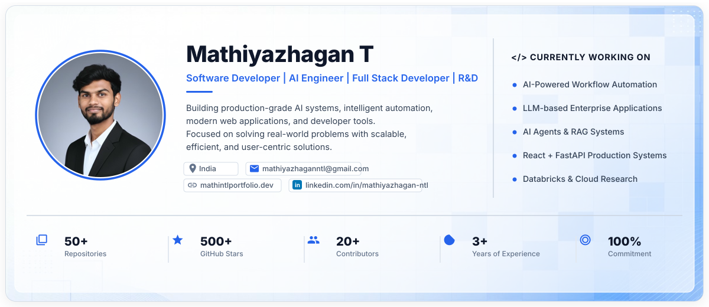

  

 

  

 

## About

Software Engineer and AI Systems Specialist focused on designing, building, and deploying production-grade enterprise software and intelligent automation pipelines. Experienced across the full stack engineering lifecycle—from high-throughput REST/gRPC backend microservices and modern frontend architectures to multi-agent orchestration and Retrieval-Augmented Generation (RAG) frameworks.

Specialized in converting complex technical requirements into scalable, reliable distributed systems, leveraging Large Language Models (LLMs), Databricks data pipelines, and containerized cloud environments. Committed to technical rigor, clean system architecture, optimal developer experience (DX), and robust production delivery.

---

## Specializations

| Core Domain | Key Competencies & Engineering Focus |
| :--- | :--- |
| **AI Engineering & LLM Architecture** | RAG Systems, Multi-Agent Orchestration, Fine-Tuning Pipelines, Prompt Engineering, Vector Databases (Qdrant, ChromaDB) |
| **Full Stack Web Engineering** | Scalable Web Applications, Modern Frontend Architecture (React, Next.js), High-Performance Backend APIs (FastAPI, Node.js) |
| **Systems & Cloud Architecture** | Microservices Architecture, Distributed Workflows, Docker Containerization, CI/CD Pipeline Automation, AWS Cloud Infrastructure |
| **Data & Platform Engineering** | ETL & ELT Pipelines, Databricks Analytics, Vector Search Implementations, High-Availability Database Schemas (PostgreSQL, Redis) |
| **Developer Experience & Tooling** | Developer CLI Tools, Automated Code Generation Frameworks, Integration Testing Automation, SDK & API Design |

---

## Tech Stack

### Languages

### Frontend Development

### Backend Engineering

### AI & Machine Learning

### Databases & Analytics

### Cloud & Infrastructure

### Automation & Developer Tools

---

## Featured Projects

| Project | Description | Technology | Current Status | Repository |
| :--- | :--- | :--- | :--- | :--- |
| **Aqua Flow Sim** | Interactive fluid dynamics and hydrological simulation engine with real-time WebGL rendering | React, TypeScript, WebGL, FastAPI | `Production-Ready` | [Repository](https://github.com/MathiyazhaganNTL/Aqua-Flow-Sim) |
| **LearnFlow Studio** | AI-assisted content curation and adaptive learning workspace powered by LLM pipelines | Next.js, Node.js, OpenAI API, PostgreSQL | `Active` | [Repository](https://github.com/MathiyazhaganNTL/LearnFlow-Studio) |
| **NTL AI Platform** | Multi-agent orchestration and autonomous task-execution engine for enterprise automation | Python, LangChain, FastAPI, Docker | `Production-Ready` | [Repository](https://github.com/MathiyazhaganNTL/NTL-AI) |
| **AI Agents Platform** | Autonomous agentic workflow engine for automated data retrieval, analysis, and execution | Python, LlamaIndex, Qdrant, Redis | `Active` | [Repository](https://github.com/MathiyazhaganNTL/AI-Agents) |
| **Automation Platform** | Distributed event-driven job queue and pipeline scheduling system | Python, Celery, Redis, Docker, FastAPI | `Production-Ready` | [Repository](https://github.com/MathiyazhaganNTL/Automation-Platform) |
| **Product Search Engine** | Vector-search semantic discovery engine delivering sub-50ms product recommendations | Python, Qdrant, FastAPI, PyTorch | `Active` | [Repository](https://github.com/MathiyazhaganNTL/Product-Search) |
| **Customer Intelligence** | Enterprise analytics platform for user interaction analysis and churn prediction modeling | React, FastAPI, Databricks, PostgreSQL | `Maintained` | [Repository](https://github.com/MathiyazhaganNTL/Customer-Intelligence) |

---

## Currently Working On

- **Enterprise AI Workflows**: Engineering multi-agent orchestration frameworks for asynchronous document processing and autonomous decision-making.
- **Production RAG Systems**: Building enterprise-grade Retrieval-Augmented Generation architectures with hybrid vector search and re-ranking pipelines.
- **Scalable Full-Stack Systems**: Developing modular React + FastAPI microservice applications backed by PostgreSQL and Redis caching.
- **Databricks & Analytics R&D**: Implementing cloud data processing workflows and LLM evaluation benchmarks using Databricks runtime.
- **Developer Infrastructure**: Designing lightweight CLI tools and developer automation scripts to streamline CI/CD delivery.

---

## GitHub Statistics

  <table border="0" width="100%">
    <tr>
      <td width="50%" valign="top">
        
      </td>
      <td width="50%" valign="top">
        
      </td>
    </tr>
  </table>

---

## Achievements & Credentials

- **National AI Hackathons**: Finalist and top performer in national-level AI and full-stack engineering hackathons.
- **Enterprise AI Systems**: Successfully architected and deployed autonomous multi-agent pipelines for production automation.
- **Data Analytics & R&D**: Conducted benchmark research on distributed processing pipelines using Databricks and vector stores.
- **Continuous Learning & Certifications**: Completed advanced specializations in Deep Learning, Cloud Architecture, and Software Engineering.

---

## Connect

| Channel | Link |
| :--- | :--- |
| **LinkedIn** | [linkedin.com/in/mathiyazhagan-ntl](https://www.linkedin.com/in/mathiyazhagan-ntl) |
| **Portfolio** | [mathintlportfolio.dev](https://mathintlportfolio.dev/) |
| **Email** | [programmermathi@gmail.com](mailto:programmermathi@gmail.com) |
| **GitHub** | [github.com/MathiyazhaganNTL](https://github.com/MathiyazhaganNTL) |
